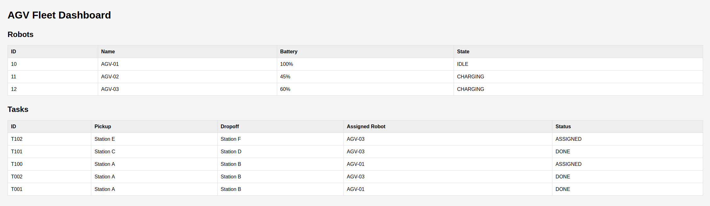

# AGV Fleet Simulator

A lightweight AGV (Automated Guided Vehicle) fleet management system built with **Python**, **FastAPI**, and **SQLite**.

This project simulates how a fleet management system assigns transportation tasks to available AGVs, tracks robot status, manages battery levels, and stores task history in a database.


## Dashboard




---

## Features

- AGV fleet management
- RESTful API built with FastAPI
- SQLite database integration
- Automatic task assignment
- Waiting task queue
- Task completion
- Battery consumption simulation
- Automatic charging state
- Simple fleet dashboard
- Git version control

---

## Tech Stack

- Python 3
- FastAPI
- SQLite
- Pydantic
- Uvicorn

---

## Project Structure

```
Project1/
│
├── api.py               # FastAPI application
├── db_init.py           # Initialize SQLite database
├── fleet.db             # SQLite database
├── fleet.json           # Initial robot configuration
├── requirements.txt
├── README.md
└── .gitignore
```

---

## Database Schema

### robots

| Column | Type |
|---------|------|
| id | INTEGER |
| name | TEXT |
| battery | INTEGER |
| state | TEXT |

---

### tasks

| Column | Type |
|---------|------|
| id | TEXT |
| pickup | TEXT |
| dropoff | TEXT |
| assigned_robot | TEXT |
| status | TEXT |

---

## API Endpoints

| Method | Endpoint | Description |
|---------|----------|-------------|
| GET | /robots | Get all robots |
| GET | /tasks | Get all tasks |
| POST | /tasks | Create a new task |
| POST | /tasks/{task_id}/complete | Complete a task |
| POST | /robots/{robot_name}/charge | Charge a robot |
| GET | /dashboard | Fleet dashboard |

---

## Run the Project

Clone repository

```bash
git clone git@github.com:XiangyuD/agv-fleet-simulator.git
```

Create virtual environment

```bash
python3 -m venv venv
```

Activate virtual environment

Linux/macOS

```bash
source venv/bin/activate
```

Windows

```bash
venv\Scripts\activate
```

Install dependencies

```bash
pip install -r requirements.txt
```

Initialize database

```bash
python db_init.py
```

Start API

```bash
uvicorn api:app --reload
```

Open Swagger UI

```
http://127.0.0.1:8000/docs
```

Dashboard

```
http://127.0.0.1:8000/dashboard
```

---

## Example Workflow

1. Create a task

```
POST /tasks
```

↓

2. Available robot is automatically assigned

↓

3. Robot state changes to ASSIGNED

↓

4. Complete task

```
POST /tasks/{task_id}/complete
```

↓

5. Battery decreases

↓

6. Robot returns to IDLE or enters CHARGING

↓

7. Waiting tasks are automatically dispatched

---

## Future Improvements

- Multi-robot scheduling
- Robot path planning
- Web frontend
- Docker deployment
- Authentication
- ROS2 integration

---

## Author

**Xiangyu Deng**

Robotics Software Engineer